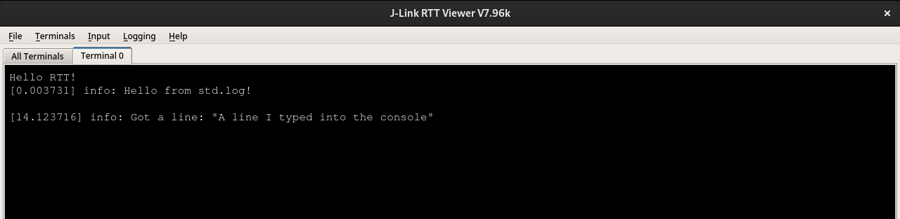
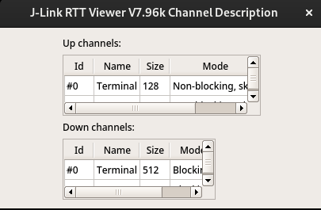
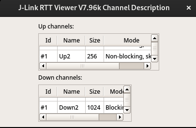

# Raspberry Pi Pico Example

This example uses RTT to do the following:
- Configures RTT with:
    - Multiple up/down channels with custom buffer sizes
    - Custom thread safety (that doesn't actually do anything)
    - RTT control block placement in a specific linker section
- Manually writes some text to up channel 0
- Utilizes the `GenericWriter` of channel 0 to have `std.log` output to [RTT Viewer](https://www.segger.com/products/debug-probes/j-link/tools/rtt-viewer/)
- Loops infinitely waiting to receive a full line from down channel 0, and then logs the received line

Running this firmware with a JLink and RTT Viewer connected the following messages print:

And when the buffer information is examined you can see our configuration was successful:

Note that this example uses the [MicroZig](https://github.com/ZigEmbeddedGroup/microzig) framework for the Raspberry Pi Pico's HAL, however MicroZig is not required to use this package.